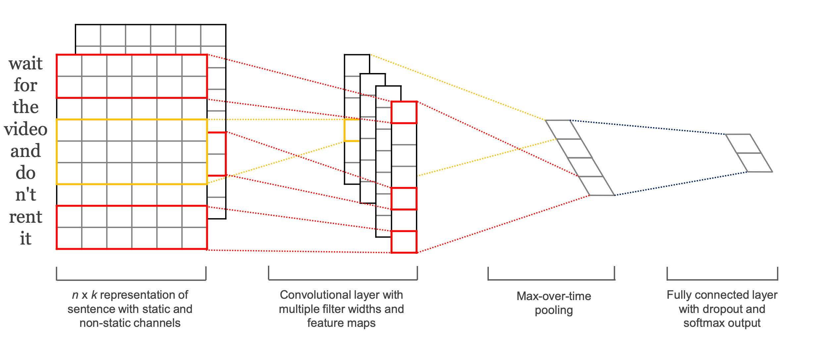
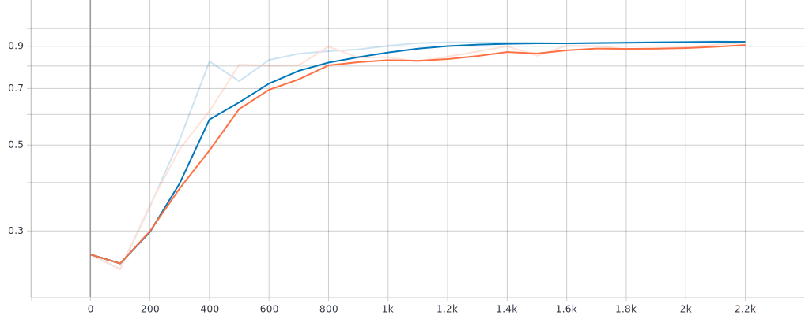
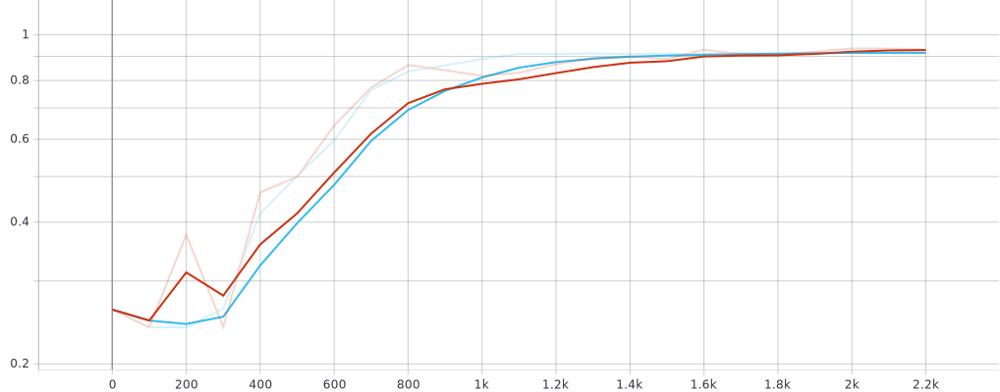
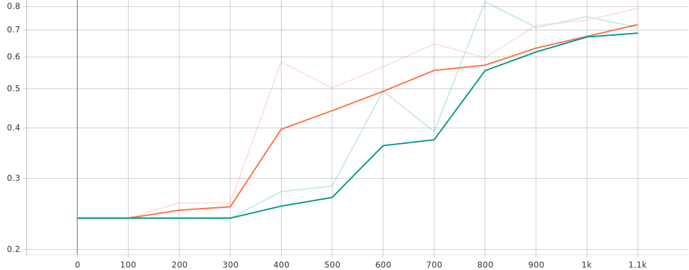
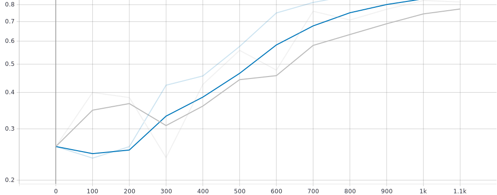

# 神经网络文本分类

## 实验方案

先统计文本可知，文件平均长度为 716 字（含空格等中文语境下的无意义符号）。

考虑到计算成本，基于字/词分别实验。

基于字的模型，将每个文本文件处理成长度为 100 的序列。

基于词的模型，将每个文本文件处理成长度为 50 的序列，不含停用词。

## TextCNN

### 网络结构与参数

 n 为句子长度，k 为嵌入维数，m 为类数。

CNN 示意图：

下图中纵向窗户长度分别取 2，3，4，然后并联，提取相邻词语的语义。



完整结构：



参数用下述类存储，其中的 `pad_size` 对字、词的情况分别改为 100、50，其他使用默认值。

```python
class Config(BaseConfig):
    def __init__(self, data_dir, class_list, vocab_path):
        self.model_name = 'TextCNN'
        super().__init__(data_dir, class_list, vocab_path)

        self.dropout = 0.5
        self.num_epoches = 20
        self.batch_size = 128
        self.pad_size = 32
        self.learning_rate = 1e-3
        self.embed = 300
        self.filter_sizes = (2, 3, 4)
        self.num_filters = 256
```

### 实验结果

下图为验证集精确度曲线，橙色为字，蓝色为词，基于词的收敛较快，且最后表现也优于基于字的。



基于字，默认参数训练得到的结果如下。最后总精确度为 92.1%。

| class | precision | recall | F1 score |
| ----- | --------- | ------ | -------- |
| 奥运  | 0.985     | 0.852  | 0.914    |
| 房产  | 0.938     | 0.928  | 0.933    |
| 商业  | 0.843     | 0.938  | 0.888    |
| 娱乐  | 0.941     | 0.964  | 0.952    |

可以看到，商业的 precision 是最差的，它涵盖的文本内容与其他交叉最多，容易将其他的也分成商业。奥运的 recall 最差。

基于词，默认参数训练得到的结果如下。最后总精确度为 92.4%。

| class | precision | recall | F1 score |
| ----- | --------- | ------ | -------- |
| 奥运  | 0.928     | 0.943  | 0.936    |
| 房产  | 0.931     | 0.894  | 0.912    |
| 商业  | 0.890     | 0.908  | 0.899    |
| 娱乐  | 0.953     | 0.957  | 0.955    |

从字改成词，最显著的影响是奥运的 recall 上升，因为“奥运”一词在确定这一分类时权重极大，有“奥运”出现必为此分类。

### 优缺点

优点：
1. 训练快，效果较好。
2. 网络结构简单，容易解释，泛化性能好。

缺点：

由于纵向窗户长度取值仅为 (2, 3, 4)，模型无法捕捉到距离较长的词之间的语义联系，导致无法提取这类语义信息。

## BiLSTM + CNN

### 网络结构与参数

BiLSTM 示意图：

由图可知 BiLSTM 可以正向、反向提取一句话的语义。


完整结构：

n 为句子长度，k 为嵌入维数，h 为 LSTM 长度（隐层长度），m 为类数。



参数如下，`pad_size` 取法同上。

```python
class Config(BaseConfig):
    def __init__(self, data_dir, class_list, vocab_path):
        self.model_name = 'BiLSTM_CNN'
        super().__init__(data_dir, class_list, vocab_path)

        self.num_epoches = 20
        self.batch_size = 128
        self.pad_size = 32
        self.learning_rate = 1e-3
        self.embed = 300
        # LSTM parameters
        self.dropout_LSTM = 0
        self.hidden_size = 256
        self.num_layers = 1
        # CNN parameters
        self.dropout_CNN = 0.5
        self.filter_sizes = (2, 3, 4)
        self.num_filters = 256
```

### 实验结果

下图为验证集精确度曲线，红色为字，天蓝色为词，基于字的前期训练效果好于词，但当 epoches 数目达到10 后被反超，最后又超过了基于词的模型。



基于字，最后总精确度为 93.5%。

| class | precision | recall | F1 score |
| ----- | --------- | ------ | -------- |
| 奥运  | 0.962     | 0.921  | 0.941    |
| 房产  | 0.939     | 0.933  | 0.936    |
| 商业  | 0.893     | 0.927  | 0.909    |
| 娱乐  | 0.953     | 0.960  | 0.957    |

基于词，最后总精确度为 91.7%。

| class | precision | recall | F1 score |
| ----- | --------- | ------ | -------- |
| 奥运  | 0.928     | 0.937  | 0.933    |
| 房产  | 0.922     | 0.898  | 0.907    |
| 商业  | 0.881     | 0.898  | 0.889    |
| 娱乐  | 0.941     | 0.940  | 0.940    |

### 优缺点

优点：

相当于利用了 BiLSTM 和 embedding 两种方式产生 features 再输入 CNN，兼具了 CNN 和 RNN 的表达能力，可解释性强，效果好。

缺点：

训练较慢，计算代价较大。


## 其他模型

除了上述两个模型，还实验了 TextRCNN，TextRNN + Attention 两个模型，都是训练较快但效果一般，其精确度曲线如下。

TextRCNN：绿色基于字，橙色基于词。



TextRNN + Attention：灰色基于字，蓝色基于词。


